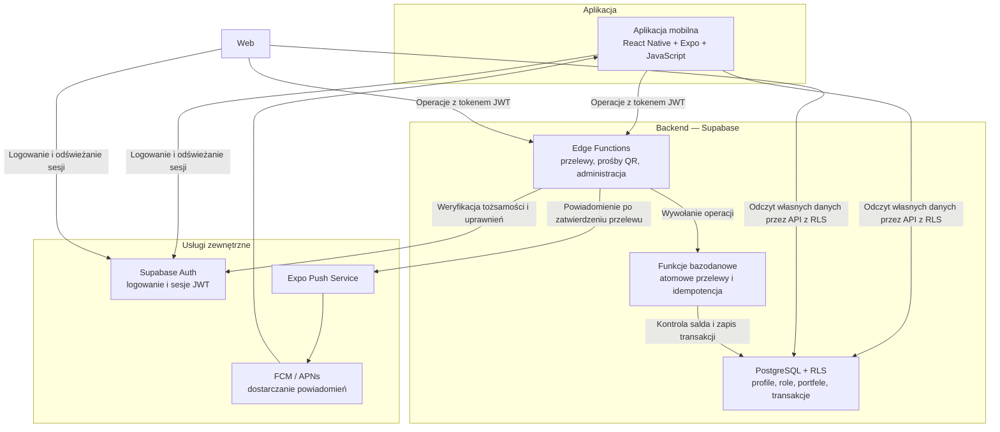

```mermaid
flowchart TD
    subgraph Clients["Aplikacja"]
        Mobile["Aplikacja mobilna<br>React Native + Expo + JavaScript"]
    end

    subgraph Backend["Backend — Supabase"]
        API["Edge Functions<br>przelewy, prośby QR, administracja"]
        DB["PostgreSQL + RLS<br>profile, role, portfele, transakcje"]
        Functions["Funkcje bazodanowe<br>atomowe przelewy i idempotencja"]
    end

    subgraph Services["Usługi zewnętrzne"]
        Auth["Supabase Auth<br>logowanie i sesje JWT"]
        Push["Expo Push Service"]
        Delivery["FCM / APNs<br>dostarczanie powiadomień"]
    end

    Mobile -->|"Logowanie i odświeżanie sesji"| Auth
    Web -->|"Logowanie i odświeżanie sesji"| Auth

    Mobile -->|"Operacje z tokenem JWT"| API
    Web -->|"Operacje z tokenem JWT"| API

    Mobile -->|"Odczyt własnych danych przez API z RLS"| DB
    Web -->|"Odczyt własnych danych przez API z RLS"| DB

    API -->|"Weryfikacja tożsamości i uprawnień"| Auth
    API -->|"Wywołanie operacji"| Functions
    Functions -->|"Kontrola salda i zapis transakcji"| DB

    API -->|"Powiadomienie po zatwierdzeniu przelewu"| Push
    Push --> Delivery
    Delivery --> Mobile
```
